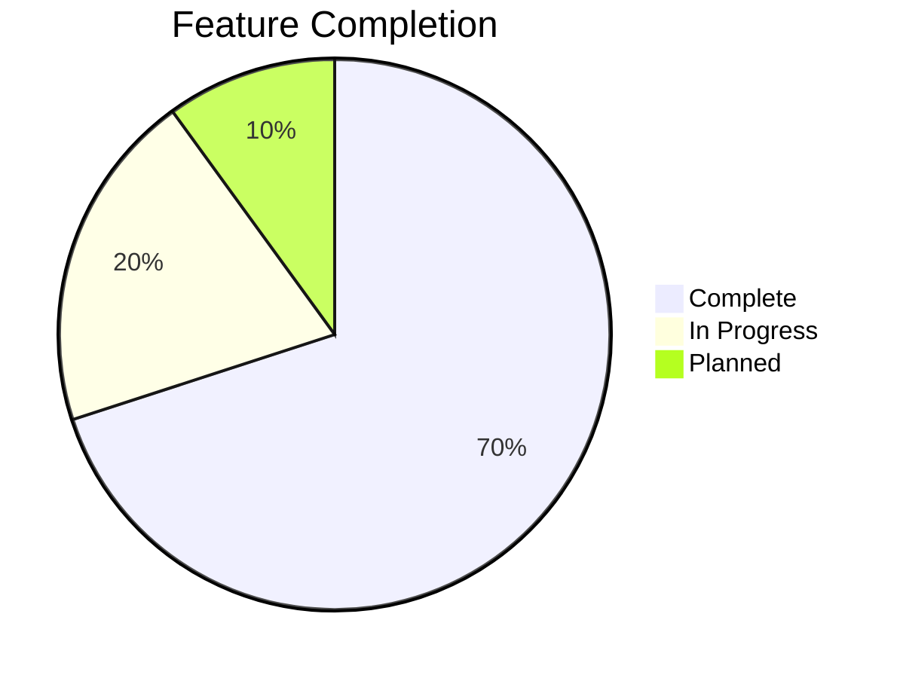
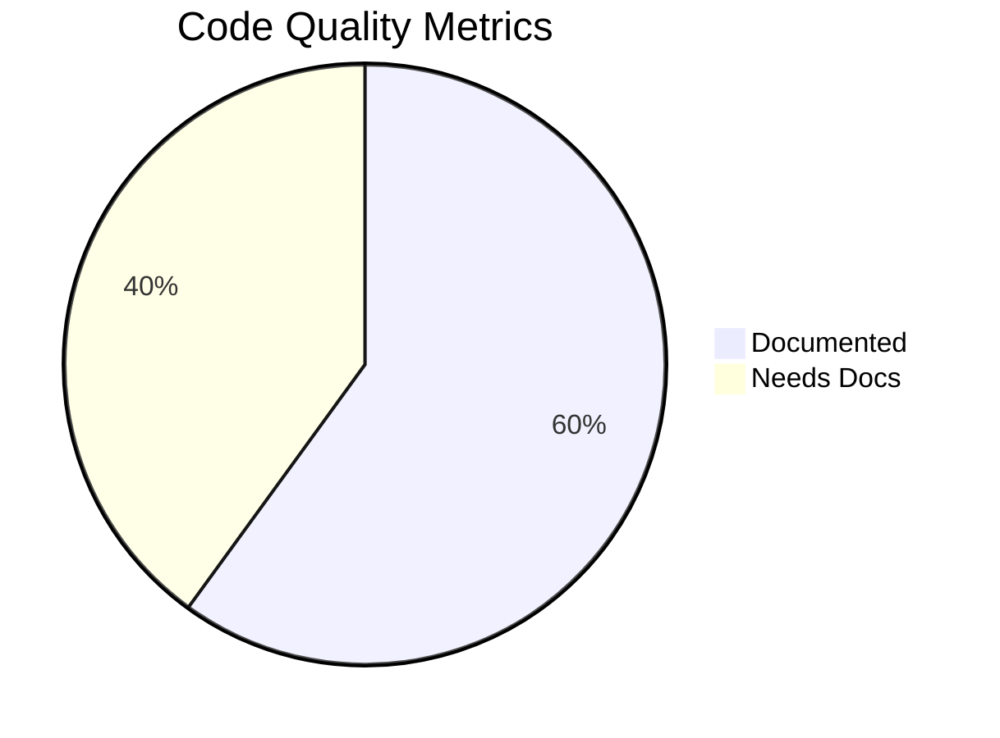
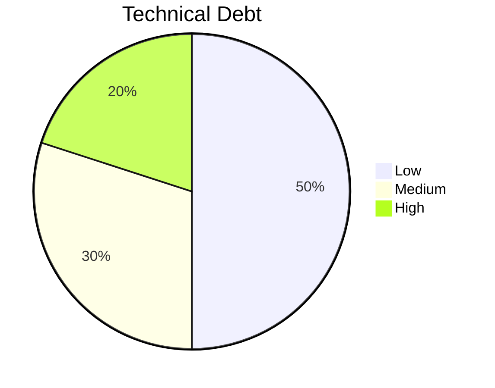

# Project Progress

## What Works

### 1. Core Functionality
- [x] Data model for changes and metrics
- [x] Knowledge repository implementation with serialization
- [x] Sample data generation
- [x] Basic TF-IDF search functionality
- [x] Token usage tracking and monitoring
- [x] Consistent dictionary-based data handling

### 2. RAG System
- [x] Multi-dimensional indexing
  - [x] Category-based indexing
  - [x] Metric impact indexing
  - [x] Temporal indexing
  - [x] Tag-based indexing
- [x] Domain knowledge management
- [x] Basic analysis capabilities

### 3. LLM Integration
- [x] Anthropic Claude integration
- [x] Structured prompt system
- [x] Basic error handling
- [x] Usage tracking

### 4. User Interface
- [x] Professional landing page with dark mode support
- [x] Dashboard view
- [x] Search interface
- [x] Impact analysis
- [x] Query interface
- [x] LLM configuration
- [x] Session state management for object persistence
- [x] Token counter persistence within sessions
- [x] Navigation state management and synchronization

## What's Left to Build

### 1. Enhanced RAG System
Phase 1: Advanced Embedding System (Completed)
- [x] Replace TF-IDF with sentence embeddings (using sentence-transformers)
- [x] Implement semantic search capabilities (with configurable embedding models)
- [x] Add hybrid retrieval (keyword + semantic with adjustable weights)
- [x] Optimize embedding performance (efficient vector storage and search)

Implementation details:
- Created configurable embedding model interface
- Implemented efficient vector storage and similarity search
- Added smart text processing and chunking
- Built hybrid search combining semantic and keyword approaches
- Provided example implementation in src/rag/embeddings/

Phase 2: Dynamic Context Selection (In Progress)
- [x] Implement sophisticated intent analysis with configurable rules
- [x] Add smart context selection based on intent
- [x] Create JSON-based configuration for selection rules
- [x] Add support for different context types (metrics, changes, domain)
- [x] Fix serialization issues in UI components
- [x] Update UI to handle dictionary data format
- [ ] Add data validation for serialized structures
- [ ] Implement caching for serialized data
- [ ] Add error handling for malformed data
- [ ] Complete integration testing of new components

Phase 3: Knowledge Graph & Relationships
- [ ] Build knowledge graph structure
- [ ] Implement relationship extraction
- [ ] Enable graph traversal
- [ ] Add causal analysis capabilities

Phase 4: Advanced Reasoning
- [ ] Implement multi-hop reasoning
- [ ] Add contextual memory system
- [ ] Create self-verification mechanisms
- [ ] Enhance response generation

### 2. Additional Features

### 3. Technical Infrastructure
- [ ] Database integration for persistent storage
  - [x] Basic token usage statistics persistence (session-based)
  - [ ] Cross-session token usage persistence
  - [ ] Query history tracking
  - [x] Basic state management using Streamlit session state
- [ ] Caching system
- [ ] Performance optimization
- [ ] UI/UX improvements
  - [x] Professional landing page with branding
  - [x] Enhanced layout and navigation
  - [x] Dark mode support
  - [x] State management and persistence
  - [ ] Improved visualizations
  - [ ] User feedback mechanisms

### 4. Testing Framework
- [ ] Unit test suite
- [ ] Integration tests
- [ ] UI tests
- [ ] Performance tests

### 5. Documentation
- [ ] API documentation
- [ ] User guide
- [ ] Developer guide
- [ ] Deployment guide

## Current Status

### 1. MVP Features

#### Complete
- Basic data structures
- Core RAG functionality
- UI components
- LLM integration

#### In Progress
- Code modularization
- Documentation
- Error handling
- Type hints

#### Planned
- Testing framework
- Performance optimization
- Enhanced features
- Infrastructure improvements

### 2. Code Quality

- **Type Hints:** Partial coverage
- **Documentation:** In progress
- **Tests:** Not started
- **Linting:** Basic setup

### 3. Technical Debt

#### Low Priority
- Additional LLM providers
- Advanced visualizations
- Caching implementation

#### Medium Priority
- Error handling improvements
- Input validation
- Performance optimization

#### High Priority
- Testing framework
- Documentation
- Type hints completion

## Known Issues

### 1. Technical Issues

#### Data Layer
- In-memory storage limitations
- No data persistence
- Limited data validation
- ✓ Fixed: Serialization consistency across layers
- ✓ Fixed: DateTime serialization in JSON context
- ✓ Fixed: Objects vs dictionaries in UI components
- ✓ Fixed: Entity handling for list vs single values

#### RAG System
- Basic TF-IDF limitations
- Search accuracy can be improved
- Performance with large datasets
- ✓ Fixed: Domain knowledge context handling
- ✓ Fixed: Entity type handling in context selection

#### LLM Integration
- Rate limiting not fully implemented
- Error recovery needs improvement
- Limited provider support

#### UI
- ✓ Professional landing page implemented
- ✓ Navigation system implemented
- ✓ Dark mode support added
- ✓ State management implemented
- Performance with large datasets
- Limited error feedback

### 2. Feature Gaps

#### Analysis
- Limited pattern recognition
- Basic trend analysis
- No predictive capabilities

#### Search
- No semantic search
- Limited fuzzy matching
- Basic relevance ranking

#### Visualization
- Limited chart types
- No custom visualizations
- Basic interactivity

### 3. Infrastructure Needs

#### Development
- No CI/CD pipeline
- Limited automated testing
- Basic error logging

#### Deployment
- Local deployment only
- No cloud support
- Limited scalability

#### Monitoring
- Basic error tracking
- No performance monitoring
- Limited usage analytics

## Next Milestones

### 1. Short-term (2 Weeks)
- [ ] Complete documentation
- [ ] Add basic tests
- [ ] Improve error handling
- [ ] Add input validation

### 2. Medium-term (1-2 Months)
- [ ] Implement semantic search
- [ ] Add database integration
- [ ] Improve analytics
- [ ] Enhance visualizations

### 3. Long-term (3+ Months)
- [ ] Add predictive features
- [ ] Implement cloud deployment
- [ ] Add monitoring system
- [ ] Scale infrastructure

## Success Metrics

### 1. Code Quality
- [ ] 90% test coverage
- [ ] Complete documentation
- [ ] No major bugs
- [ ] Clean architecture

### 2. Performance
- [ ] Sub-second query response
- [ ] Efficient resource usage
- [ ] Smooth UI experience
- [ ] Reliable LLM integration

### 3. User Experience
- [ ] Intuitive interface
- [ ] Helpful insights
- [ ] Reliable operation
- [ ] Valuable recommendations

## Risk Assessment

### 1. Technical Risks
- LLM API reliability
- Performance scalability
- Data consistency
- System complexity

### 2. Project Risks
- Resource constraints
- Timeline pressure
- Feature scope
- Technical debt

### 3. Mitigation Plans
- Regular testing
- Incremental development
- User feedback
- Technical reviews
