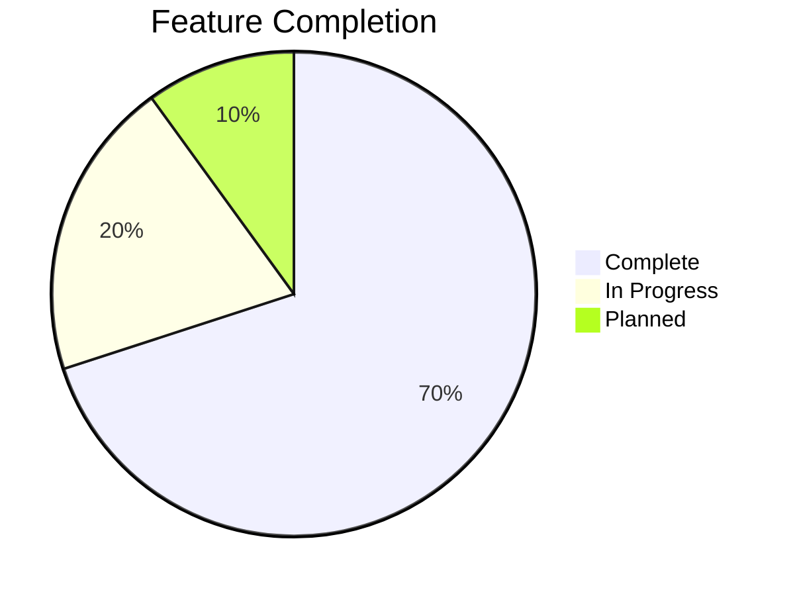
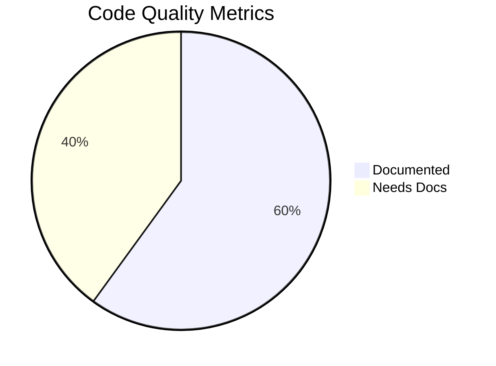
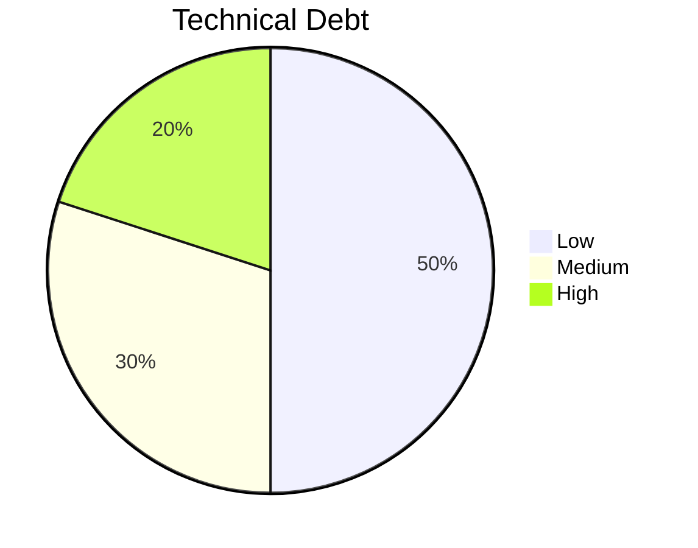

# Project Progress

## What Works

### 1. Core Functionality
- [x] Data model for changes and metrics
- [x] Knowledge repository implementation
- [x] Sample data generation
- [x] Basic TF-IDF search functionality

### 2. RAG System
- [x] Multi-dimensional indexing
  - [x] Category-based indexing
  - [x] Metric impact indexing
  - [x] Temporal indexing
  - [x] Tag-based indexing
- [x] Domain knowledge management
- [x] Basic analysis capabilities

### 3. LLM Integration
- [x] Anthropic Claude integration
- [x] Structured prompt system
- [x] Basic error handling
- [x] Usage tracking

### 4. User Interface
- [x] Dashboard view
- [x] Search interface
- [x] Impact analysis
- [x] Query interface
- [x] LLM configuration

## What's Left to Build

### 1. Enhanced Features
- [ ] Semantic search implementation
- [ ] Advanced analytics capabilities
- [ ] Automated pattern recognition
- [ ] Predictive recommendations

### 2. Technical Infrastructure
- [ ] Database integration
- [ ] Persistent storage
- [ ] Caching system
- [ ] Performance optimization

### 3. Testing Framework
- [ ] Unit test suite
- [ ] Integration tests
- [ ] UI tests
- [ ] Performance tests

### 4. Documentation
- [ ] API documentation
- [ ] User guide
- [ ] Developer guide
- [ ] Deployment guide

## Current Status

### 1. MVP Features

#### Complete
- Basic data structures
- Core RAG functionality
- UI components
- LLM integration

#### In Progress
- Code modularization
- Documentation
- Error handling
- Type hints

#### Planned
- Testing framework
- Performance optimization
- Enhanced features
- Infrastructure improvements

### 2. Code Quality

- **Type Hints:** Partial coverage
- **Documentation:** In progress
- **Tests:** Not started
- **Linting:** Basic setup

### 3. Technical Debt

#### Low Priority
- Additional LLM providers
- Advanced visualizations
- Caching implementation

#### Medium Priority
- Error handling improvements
- Input validation
- Performance optimization

#### High Priority
- Testing framework
- Documentation
- Type hints completion

## Known Issues

### 1. Technical Issues

#### Data Layer
- In-memory storage limitations
- No data persistence
- Limited data validation

#### RAG System
- Basic TF-IDF limitations
- Search accuracy can be improved
- Performance with large datasets

#### LLM Integration
- Rate limiting not fully implemented
- Error recovery needs improvement
- Limited provider support

#### UI
- State management complexity
- Performance with large datasets
- Limited error feedback

### 2. Feature Gaps

#### Analysis
- Limited pattern recognition
- Basic trend analysis
- No predictive capabilities

#### Search
- No semantic search
- Limited fuzzy matching
- Basic relevance ranking

#### Visualization
- Limited chart types
- No custom visualizations
- Basic interactivity

### 3. Infrastructure Needs

#### Development
- No CI/CD pipeline
- Limited automated testing
- Basic error logging

#### Deployment
- Local deployment only
- No cloud support
- Limited scalability

#### Monitoring
- Basic error tracking
- No performance monitoring
- Limited usage analytics

## Next Milestones

### 1. Short-term (2 Weeks)
- [ ] Complete documentation
- [ ] Add basic tests
- [ ] Improve error handling
- [ ] Add input validation

### 2. Medium-term (1-2 Months)
- [ ] Implement semantic search
- [ ] Add database integration
- [ ] Improve analytics
- [ ] Enhance visualizations

### 3. Long-term (3+ Months)
- [ ] Add predictive features
- [ ] Implement cloud deployment
- [ ] Add monitoring system
- [ ] Scale infrastructure

## Success Metrics

### 1. Code Quality
- [ ] 90% test coverage
- [ ] Complete documentation
- [ ] No major bugs
- [ ] Clean architecture

### 2. Performance
- [ ] Sub-second query response
- [ ] Efficient resource usage
- [ ] Smooth UI experience
- [ ] Reliable LLM integration

### 3. User Experience
- [ ] Intuitive interface
- [ ] Helpful insights
- [ ] Reliable operation
- [ ] Valuable recommendations

## Risk Assessment

### 1. Technical Risks
- LLM API reliability
- Performance scalability
- Data consistency
- System complexity

### 2. Project Risks
- Resource constraints
- Timeline pressure
- Feature scope
- Technical debt

### 3. Mitigation Plans
- Regular testing
- Incremental development
- User feedback
- Technical reviews
