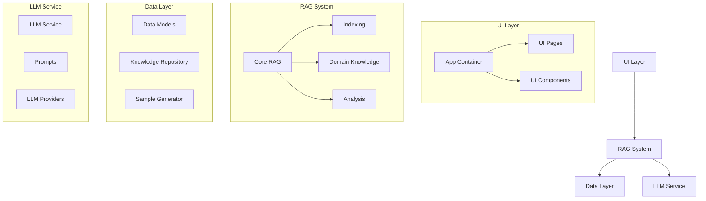

# System Architecture & Design Patterns

## Overall Architecture

The system follows a modular architecture with clear separation of concerns:



## Directory Structure

```
LiveOpsAgent/
├── src/                           # Source code
│   ├── data/                      # Data layer
│   │   ├── models.py             # Core data models
│   │   ├── repository.py         # Knowledge repository
│   │   └── sample_generator.py   # Sample data generation
│   │
│   ├── rag/                      # RAG system components
│   │   ├── core.py              # Core RAG functionality
│   │   ├── indexing/            # Indexing strategies
│   │   ├── domain_knowledge/    # Domain knowledge management
│   │   └── analysis/           # Analysis capabilities
│   │
│   ├── llm/                      # LLM integration
│   │   ├── service.py           # LLM service
│   │   ├── providers/           # LLM providers
│   │   └── prompts/            # Structured prompts
│   │
│   ├── ui/                       # UI components
│   │   ├── app.py              # Main app container
│   │   └── pages/              # Page components
│   │
│   └── evaluators/              # Future evaluators
│
├── config/                       # Configuration
├── tests/                       # Tests
└── memory-bank/                 # Memory Bank files
```

## Key Design Patterns

### 1. Repository Pattern
- `KnowledgeRepository` acts as a centralized data store
- Provides methods for adding and retrieving changes and metrics
- Abstracts data storage details from the rest of the system

### 2. Service Layer Pattern
- `LLMService` encapsulates LLM interaction details
- Handles API communication, rate limiting, and error handling
- Provides a clean interface for LLM operations

### 3. Strategy Pattern
- Used in the indexing system to support different indexing strategies
- Each index type (category, metric, temporal, tag) follows the same interface
- Makes it easy to add new indexing strategies

### 4. Factory Pattern
- Used in prompt generation to create different types of prompts
- Each prompt type has its own generator function
- Makes it easy to maintain and modify prompt structures

### 5. Facade Pattern
- `EnhancedRAGSystem` provides a simplified interface to the complex subsystems
- Coordinates between data layer, indexing, domain knowledge, and analysis
- Makes the system easier to use from the UI layer

### 6. Observer Pattern
- Used in the UI for state management with Streamlit
- Components react to state changes automatically
- Enables interactive UI updates

## Component Responsibilities

### Data Layer
- Define data structures for changes and metrics
- Manage data storage and retrieval
- Generate sample data for testing

### RAG System
- Core: Coordinate between components
- Indexing: Build and maintain search indexes
- Domain Knowledge: Manage domain-specific context
- Analysis: Analyze changes and generate insights

### LLM Service
- Handle LLM API integration
- Manage prompts and responses
- Support multiple LLM providers

### UI Layer
- Present data and insights
- Handle user interactions
- Manage application state

## Design Decisions

1. **Modular Structure**
   - Each component is self-contained
   - Clear interfaces between components
   - Easy to modify or replace individual parts

2. **Extensible Architecture**
   - Easy to add new features
   - Support for multiple LLM providers
   - Flexible indexing system

3. **Separation of Concerns**
   - UI logic separate from business logic
   - Data layer independent of presentation
   - Clear boundaries between components

4. **Configuration Over Code**
   - Domain knowledge in configuration
   - LLM settings configurable
   - Easy to modify system behavior

5. **Future-Proof Design**
   - Support for additional evaluators
   - Flexible data model
   - Scalable architecture

## Implementation Notes

1. **Code Organization**
   - Each module in its own directory
   - Clear file naming conventions
   - Logical grouping of related functionality

2. **Dependencies**
   - Minimal coupling between components
   - Clear dependency flow
   - Easy to understand relationships

3. **Error Handling**
   - Graceful fallbacks for LLM failures
   - Clear error messages
   - Robust error recovery

4. **Performance Considerations**
   - Efficient indexing strategies
   - Smart caching opportunities
   - Optimized data structures

5. **Testing Strategy**
   - Each component independently testable
   - Clear interfaces for mocking
   - Comprehensive test coverage possible
